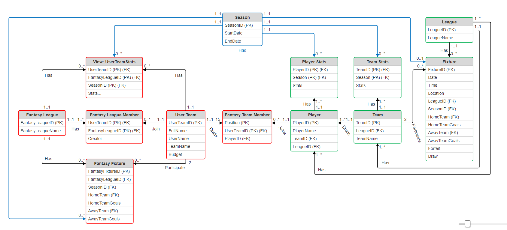

# ⚽ Fantasy Football Manager – SQL Database Project

This project is a comprehensive **relational database system** designed to replicate the core data and logic behind the **Fantasy Premier League (FPL)** platform. It manages real-life football data (teams, players, matches) as well as user-generated fantasy data (user teams, leagues, fantasy fixtures).

---

## 🎯 Objective

To develop a robust SQL database that:

- Stores and manages real-world football statistics from the English Premier League.
- Enables users to create fantasy leagues and draft fantasy teams.
- Simulates fantasy fixtures and updates statistics.
- Offers a strong foundation for future API integration or frontend development.

---

## 🧠 Motivation

Millions of users play FPL globally. Yet, there's a lack of open, customizable systems that replicate its backend. This project bridges that gap by building:

- A normalized SQL schema (3NF)
- Sample queries and views to analyze performance
- Foundation for live simulation and management of fantasy leagues

---

## 🗂️ Database Overview

### 👥 Entities
| Real-world Side     | Fantasy Side              |
|---------------------|---------------------------|
| Season              | FantasyLeague             |
| League              | UserTeam                  |
| Team                | FantasyTeamMember         |
| TeamStats           | FantasyLeagueMember       |
| Player              | FantasyFixture            |
| PlayerStats         | UserTeamStats             |
| Fixture             |                           |

- Schema is **fully normalized to 3NF**
- Views like `total_teamstats`, `total_playerstats`, and `total_userteamstats` provide all-time performance summaries

---

## 🔧 Core Features

### ✅ Real Data Storage
- Player, team, fixture, and season information from Premier League
- Manually entered (future integration via [FPL API](https://fantasy.premierleague.com))

### ✅ Fantasy Gameplay Logic
- Users can:
  - Create/join leagues
  - Draft up to 15 players to a team
  - Compete in fantasy fixtures (home/away)
- Admins can:
  - Track user teams, simulate fixtures, and update stats

### ✅ SQL Scripts Support
- Insert, Update, and Select statements
- Fixture simulation + stats update (via stored procedures or scripts)

---

## 📊 ER Diagram

- Separates **real football entities** from **fantasy components**
- Linked via keys like `playerID`, `userTeamID`, and `seasonID`

---

## 🧪 Testing & Results

- Sample data was inserted for:
  - 20+ teams
  - 100+ players
  - Sample users, leagues, and fantasy teams
- Queries tested include:
  - Player performance across seasons
  - Fantasy league standings
  - Fixture matchups and stat updates

---

## 🚧 Challenges & Considerations

### What Worked:
- Normalized schema design (3NF)
- Efficient data retrieval using joins and views
- Manual simulation of fantasy fixtures

### What Needs Work:
- Budget enforcement and player uniqueness (custom SQL constraints needed)
- Transactional control for fantasy fixtures (avoid dirty writes)
- FPL API integration for automated data ingestion

---

## 🚀 Future Work

- ⚙️ Automate data import from FPL’s public API
- 🧠 Enhance logic for fantasy score calculation
- 🌐 Build a web-based frontend using Flask or React
- 📱 Enable user login and team management via UI

---

#
